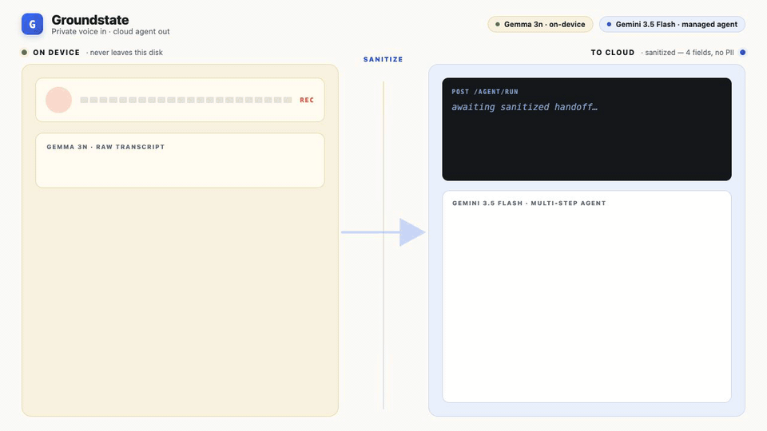

# Groundstate

Privacy-preserving local/cloud workspace coordination agent. Hackathon submission.

A voice-driven workspace agent that pairs a local on-device LLM (MLX) with cloud Gemini for tasks that need broader knowledge, while keeping sensitive context local by default.



**What you're seeing:** raw voice + transcript are captured and processed entirely on-device by Gemma 3n. A sanitizer strips PII and produces a tiny 4-field JSON payload. Only that payload crosses the wire to Gemini 3.5 Flash, which runs as a managed agent and orchestrates the real workspace tools (calendar, email, etc.) — all while the privileged source memo never leaves the local disk.

## Stack

- **Local LLM**: `mlx-vlm` for on-device inference
- **Cloud**: Google Gemini via `google-genai`
- **Audio**: `sounddevice` + `scipy` for capture
- **Server**: FastAPI + SSE for streaming
- **Workspace integrations**: Google APIs (Calendar, Drive, etc.) via OAuth

## Setup

```bash
python -m venv .venv && source .venv/bin/activate
pip install -e .
cp .env.example .env  # then fill in keys
```

Required env vars (see `.env.example`):
- `GEMINI_API_KEY`
- `GOOGLE_OAUTH_CLIENT_SECRETS` — path to OAuth client secret JSON
- `DEFAULT_TIMEZONE`

## Run

```bash
uvicorn src.main:app --reload
```

## Tests

```bash
pytest
```

## Layout

- `src/` — agent, audio, tools, FastAPI app
- `src/workspace/` — Google Workspace integrations
- `tests/` — unit tests
- `implementation_plan.md` — design notes
